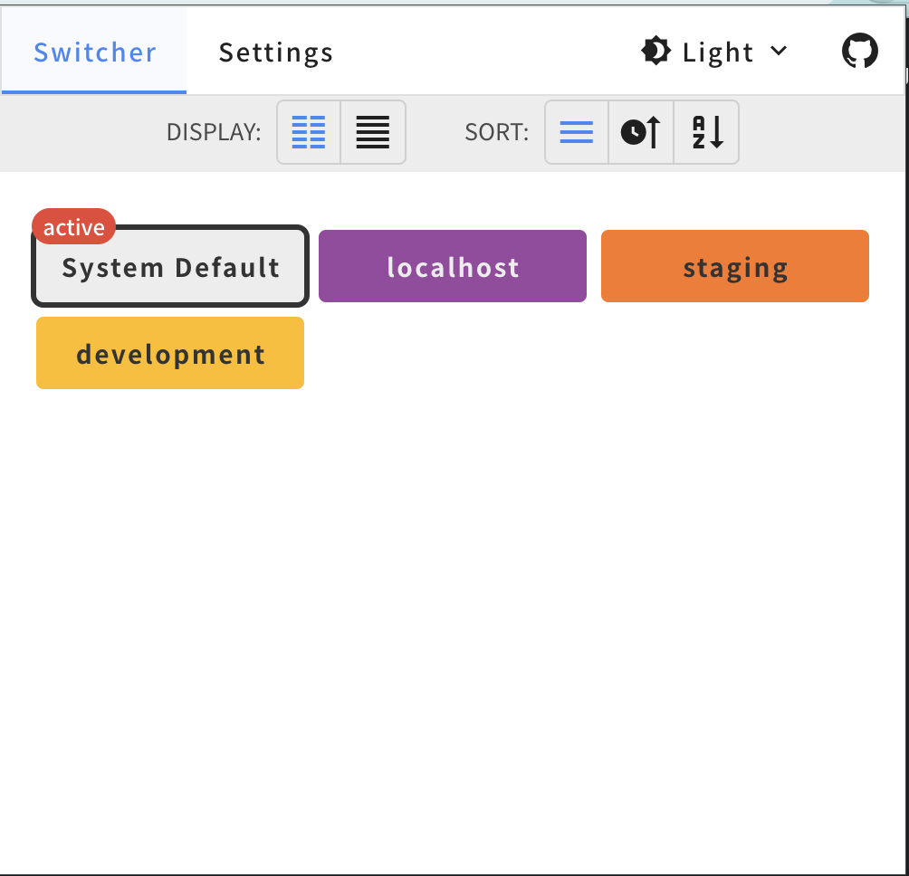

# Proxy Pac Switcher Extension

It may be necessary to change the proxy and connect to the server during development or operation. At that time, there is a method of setting the proxy with a PAC (Proxy Auto Configuration) file. This tool makes that setting easier and allows you to switch between multiple configurations.
## Screenshots




## Development
### commands

```bash
yarn serve

yarn build

yarn lint
```
